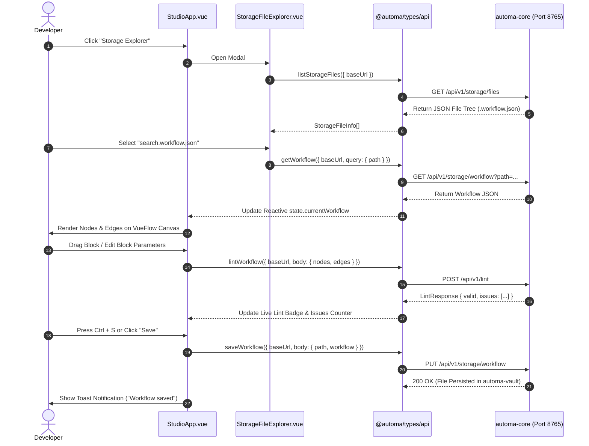
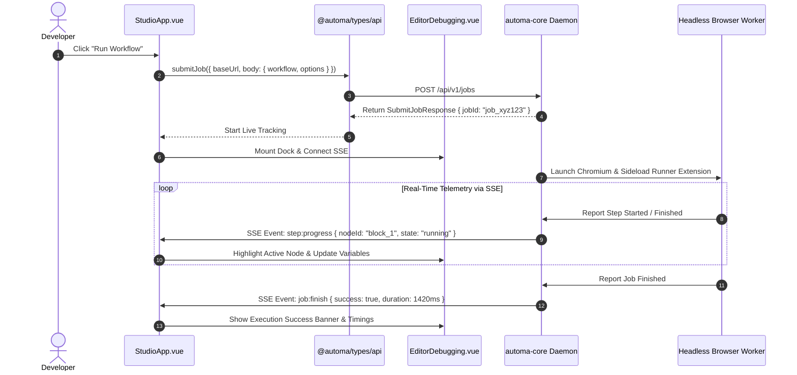

# Software Requirements Specification (SRS)
## Automa Web Studio Standalone (Canvas Editor)

> **Tài liệu đặc tả yêu cầu phần mềm (SRS)**  
> **Dự án**: Automa Ecosystem  
> **Module**: Automa Web Studio Standalone (`automa-studio`)  
> **Thư mục mã nguồn**: `automa-ext/src/studio/`  
> **Trạng thái**: Hoàn thiện & Đang hoạt động (Production-Ready)  
> **Phiên bản tài liệu**: v1.1.0

---

## 1. Giới thiệu tổng quan (Introduction)

### 1.1. Mục đích tài liệu
Tài liệu SRS này mô tả toàn diện các yêu cầu chức năng (Functional Requirements), yêu cầu phi chức năng (Non-Functional Requirements), kiến trúc kỹ thuật (Software Architecture), các luồng dữ liệu (Data Flows), và cơ chế giao tiếp IPC của **Automa Web Studio Standalone** — trình soạn thảo quy trình tự động hóa dạng đồ thị thị giác (Visual Workflow Canvas Editor) chạy độc lập trên nền web mà không phụ thuộc vào môi trường Chrome Extension truyền thống.

Đặc biệt, tài liệu làm rõ cơ chế **Contract-First & Central Type Hub**: toàn bộ giao tiếp giữa Studio Standalone và Rust Daemon `automa-core` được định kiểu an toàn (100% Type-Safe) thông qua SDK Client tập trung **`@automa/types/api`**.

### 1.2. Phạm vi sản phẩm (Product Scope)
Trong hệ sinh thái Automa Ecosystem, `automa-studio` đóng vai trò là **UI/UX Core** cho việc trực quan hóa, thiết kế, gỡ lỗi (debugging) và quản lý kịch bản tự động hóa:
- **Build Target**: Được đóng gói độc lập thông qua `webpack.studio.config.js` xuất ra thư mục `automa-ext/dist/studio/`.
- **Daemon Web Server**: Được nhúng và phục vụ trực tiếp (natively hosted) bởi Daemon Rust `automa-core` tại endpoint tĩnh `http://127.0.0.1:8765/studio/` thông qua `tower_http::services::ServeDir`.
- **Client Consumers**:
  1. **Trình duyệt Web Tiêu chuẩn**: Chạy trên Google Chrome, Brave, MS Edge, Mozilla Firefox, Apple Safari.
  2. **VS Code Extension (`automa-vscode`)**: Kích hoạt nhanh thông qua lệnh `Open in Studio` hoặc task `[Preset] Live Studio`.
  3. **Iframe / Embedded Host**: Có khả năng nhúng vào bất kỳ dashboard quản trị hoặc web view bên ngoài nào thông qua giao thức W3C standard `postMessage`.

---

## 2. Kiến trúc Contract-First & Liên kết qua `@automa/types/api` (Central Type Hub)

### 2.1. Nguyên tắc Single Source of Truth
Hệ sinh thái áp dụng kiến trúc **Contract-First**:
1. `automa-core` (Rust Axum Backend) định nghĩa OpenAPI v3 Schema và Annotations (`#[utoipa::path(...)]`).
2. Mã nguồn OpenAPI được xuất tĩnh thành `packages/automa-types/openapi.json`.
3. `@hey-api/openapi-ts` tự động sinh ra TypeScript Client SDK và DTO interfaces tại package `@automa/types/api`.
4. `automa-ext/src/studio` tiêu thụ các hàm API Client trực tiếp từ `@automa/types/api` qua giao thức PNPM Workspace (`"@automa/types": "workspace:*"`).

> [!IMPORTANT]
> **Quy tắc bất biến**: `automa-ext/src/studio` **TUYỆT ĐỐI KHÔNG** tự gọi `fetch()` với URL chuỗi cứng hay tự sinh API types riêng rẽ. Toàn bộ các tác vụ gọi Daemon (Workflow CRUD, Run Job, Live Lint, Storage Data) **BẮT BUỘC** thông qua SDK methods của `@automa/types/api`.

### 2.2. Sơ đồ Chuỗi liên kết SDK (End-to-End Contract Flow)

```mermaid
graph TD
    subgraph RustCore [automa-core (Rust Backend)]
        RustHandlers["Rust Route Handlers<br/>(jobs.rs, vault.rs, storage.rs, lint.rs)"]
        UtoipaDoc["ApiDoc (Utoipa OpenAPI v3)"]
        ExportCLI["automa-core --export-openapi<br/>-> packages/automa-types/openapi.json"]
        RustHandlers --> UtoipaDoc
        UtoipaDoc --> ExportCLI
    end

    subgraph CentralTypeHub [@automa/types (Central Package)]
        OpenApiSpec["openapi.json (OpenAPI 3.1)"]
        OpenApiTS["@hey-api/openapi-ts Generator"]
        SDKClient["@automa/types/api (Typed SDK Client)<br/>- submitJob()<br/>- getWorkflow() / saveWorkflow()<br/>- lintWorkflow()<br/>- getStorageTables() / getStorageVariables()<br/>- client (Fetch Client Instance)"]
        
        ExportCLI --> OpenApiSpec
        OpenApiSpec --> OpenApiTS
        OpenApiTS --> SDKClient
    end

    subgraph StudioFrontend [automa-ext (Studio Standalone)]
        StudioApp["StudioApp.vue<br/>(Submit Job, Save/Load, Live Lint)"]
        StorageSvc["storage-service.js<br/>(Tables, Variables, Credentials, Sync Queue)"]
        FileExplorer["StorageFileExplorer.vue<br/>(Vault File Tree)"]

        SDKClient -->|import { submitJob, getWorkflow, saveWorkflow, lintWorkflow }| StudioApp
        SDKClient -->|import { client, getTables, addTable, getVariables, listStorageFiles }| StorageSvc
        StorageSvc --> FileExplorer
    end

    subgraph RuntimeCommunication [Runtime Communication (Port: 8765)]
        StudioApp -->|REST HTTP via @automa/types/api| RustHandlers
        StorageSvc -->|REST HTTP via @automa/types/api| RustHandlers
        RustHandlers -->|Server-Sent Events /api/v1/events| StudioApp
    end
```

### 2.3. Bảng ánh xạ SDK Methods trong Studio

| SDK Method (`@automa/types/api`) | Tệp tiêu thụ trong Studio | Endpoint Daemon tương ứng | Mục đích sử dụng |
| :--- | :--- | :--- | :--- |
| `getWorkflow(options)` | [`StudioApp.vue`](StudioApp.vue), [`StorageFileExplorer.vue`](StorageFileExplorer.vue) | `GET /api/v1/storage/workflow` | Nạp nội dung kịch bản JSON từ thư mục `automa-vault` lên VueFlow canvas. |
| `saveWorkflow(options)` | [`StudioApp.vue`](StudioApp.vue) | `PUT /api/v1/storage/workflow` | Lưu kịch bản đã qua chuẩn hóa (`nanoid`, edge handles) vào file trên đĩa (`Ctrl+S`). |
| `submitJob(options)` | [`StudioApp.vue`](StudioApp.vue) | `POST /api/v1/jobs` | Gửi kịch bản đang mở tới Rust Daemon để khởi chạy tiến trình tự động hóa trên trình duyệt thực tế. |
| `lintWorkflow(options)` | [`StudioApp.vue`](StudioApp.vue) | `POST /api/v1/lint` | Thực hiện kiểm tra lỗi tĩnh (Static Analysis) thời gian thực trên đồ thị AST (Debounced 500ms). |
| `listStorageFiles(options)` | [`storage-service.js`](storage-service.js) | `GET /api/v1/storage/files` | Truy xuất danh sách tệp kịch bản `.workflow.json` và `.campaigns.json` phục vụ cho modal Storage Explorer. |
| `getStorageTables(options)` / `addStorageTable` / `deleteStorageTable` | [`storage-service.js`](storage-service.js) | `/api/v1/storage/tables` | Quản lý bảng dữ liệu Global Storage, phân trang dữ liệu dòng (Rows). |
| `getStorageVariables(options)` / `addStorageVariable` / `deleteStorageVariable` | [`storage-service.js`](storage-service.js) | `/api/v1/storage/variables` | Quản lý danh sách biến toàn cục (Key-Value pairs). |
| `getStorageCredentials(options)` | [`storage-service.js`](storage-service.js) | `/api/v1/storage/credentials` | Lấy danh sách khóa bí mật mã hóa AES-256. |
| `client` (`createClient` instance) | [`storage-service.js`](storage-service.js) | Tùy biến endpoint qua `client.post/delete/patch` | Xử lý xả hàng đợi đồng bộ ngoại tuyến (`flushSyncQueue`) khi kết nối Daemon phục hồi. |

---

## 3. Kiến trúc tổng thể & Nguyên lý hoạt động (System Architecture)

```mermaid
graph TB
    subgraph ClientHost [Client Hosting Environments]
        WebBrowser["Standard Web Browser (Tab)"]
        VSCodeHost["VS Code Webview Host"]
        IframeHost["External Web Dashboard (Iframe)"]
    end

    subgraph StudioStandalone [Automa Studio Standalone (Vue 3 + VueFlow)]
        Entry["studio-entry.js<br/>(Vue 3 App + Pinia + Vue-i18n)"]
        CanvasUI["StudioApp.vue<br/>(VueFlow Canvas + Resizable Sidebars)"]
        
        subgraph CoreSubsystems [Studio Core Subsystems]
            Bridge["standalone-bridge.js<br/>(Tri-Environment Host Adapter)"]
            MockProxy["standalone-browser-mock.js<br/>(Recursive Browser API Proxy)"]
            StorageSvc["storage-service.js<br/>(Offline Dexie DB + Sync Queue)"]
            FileExp["StorageFileExplorer.vue<br/>(Vault File Browser)"]
        end
    end

    subgraph RustDaemon [automa-core Backend (Port: 8765)]
        StaticServe["/studio -> ServeDir(automa-ext/dist/studio)"]
        RestAPI["REST API (/api/v1/jobs, /storage, /lint, /browsers)"]
        SSEStream["SSE Event Bus (/api/v1/events, /jobs/worker/sse)"]
        SqliteDB[("SQLite Database + automa-vault Files")]
    end

    WebBrowser -->|HTTP GET /studio| StaticServe
    VSCodeHost -->|Acquire VS Code API| Bridge
    IframeHost -->|W3C postMessage| Bridge
    
    Entry --> CanvasUI
    CanvasUI --> Bridge
    CanvasUI --> StorageSvc
    CanvasUI --> FileExp
    
    MockProxy -.->|Polyfill chrome.* & browser.*| CanvasUI
    
    StorageSvc -->|REST Requests via @automa/types/api| RestAPI
    CanvasUI -->|Submit Job & Lint via @automa/types/api| RestAPI
    CanvasUI <-->|Real-time Telemetry & Logs| SSEStream
    RestAPI --> SqliteDB
```

---

## 4. Cấu trúc thư mục & Bản đồ thành phần (Component Map)

| Tệp nguồn | Trách nhiệm chính (Single Responsibility) | Ghi chú kỹ thuật |
| :--- | :--- | :--- |
| [`studio-entry.js`](studio-entry.js) | Entry point chính của ứng dụng Vue 3 standalone. Khởi tạo Vue Router (Memory History), Pinia, VueUse Head, Toastification, RemixIcon, và nạp tĩnh bộ Locale tiếng Anh (0-network dependency). Tích hợp cơ chế tự động thăm dò Live-Reload (`HEAD studio.bundle.js`). | 96 dòng |
| [`StudioApp.vue`](StudioApp.vue) | Thành phần gốc (Root Component) chứa toàn bộ layout: Top Header Bar, Resizable Sidebar (Block Form Editor & Palette), VueFlow Canvas, Debugger Dock, Modals (Tables, Variables, Settings, Logs, Storage Explorer). Tích hợp `@automa/types/api` cho Workflow CRUD, Run Job và Live Linting. | 1793 dòng |
| [`standalone-bridge.js`](standalone-bridge.js) | Cầu nối đa môi trường (Universal Host Adapter) áp dụng *Registry Pattern*. Thay thế IndexedDB/chrome.storage gốc bằng bộ nhớ phản ứng (Reactive In-memory DB) và phát thông điệp đồng bộ 3 chiều (`VsCodeHostAdapter`, `IframeHostAdapter`, `StandaloneHostAdapter`). | 247 dòng |
| [`standalone-browser-mock.js`](standalone-browser-mock.js) | Bộ giả lập Chrome/Browser API toàn diện sử dụng **Recursive Proxy Pattern**. Ngăn chặn mọi lỗi crash (`undefined is not a function`) khi các block hoặc thư viện gọi các API tiện ích mở rộng như `chrome.tabs`, `chrome.storage.local`, `chrome.runtime`. | 155 dòng |
| [`storage-service.js`](storage-service.js) | Triển khai *Repository Pattern* kết hợp bộ nhớ đệm Offline (**Dexie IndexedDB**) và Hàng đợi tự động đồng bộ (**Auto-Sync Queue**) kết nối với REST API của `automa-core` thông qua `@automa/types/api`. | 330 dòng |
| [`StorageFileExplorer.vue`](StorageFileExplorer.vue) | Modal quản lý và duyệt cây thư mục kịch bản (`automa-vault`), cho phép lọc nhanh, tìm kiếm, xem trước siêu dữ liệu và nạp trực tiếp workflow lên Canvas qua SDK Client. | 225 dòng |
| [`index.html`](index.html) | Mẫu HTML độc lập nhúng font Inter và container `#app`. | 24 dòng |

---

## 5. Yêu cầu chức năng chi tiết (Functional Requirements)

### FR-1: Visual Workflow Canvas & Block Authoring (Soạn thảo đồ thị quy trình)
- **FR-1.1**: Tích hợp `@vue-flow/core` để biểu diễn quy trình dưới dạng đồ thị có hướng (Directed Acyclic Graph - DAG) với các khối (Nodes) và dây nối (Edges).
- **FR-1.2**: Hỗ trợ đầy đủ các thao tác tương tác đồ thị: Pan (kéo vùng làm việc), Zoom (phóng to/thu nhỏ), Multi-selection (chọn nhiều khối), Box selection, và Minimap thu nhỏ.
- **FR-1.3 (Block Palette & Drag-and-Drop)**: Cung cấp thanh công cụ phân loại khối (Triggers, Web Interaction, Control Flow, Data Extraction, Online Services). Cho phép kéo-thả khối từ Sidebar vào thẳng tọa độ Canvas.
- **FR-1.4 (Block Configuration Sidebar)**: Khi người dùng click chọn một khối trên Canvas, Sidebar bên trái tự động chuyển sang chế độ chỉnh sửa tham số chi tiết (`workflow-edit-block`) tương ứng với schema dữ liệu của khối đó.
- **FR-1.5 (Auto-Align Layout)**: Tích hợp thuật toán sắp xếp tự động đồ thị theo luồng thực thi từ trái sang phải, ngăn ngừa chồng lấn khối.
- **FR-1.6 (Undo / Redo History)**: Quản lý lịch sử thay đổi đồ thị (Thêm/xóa node, đổi tham số, di chuyển vị trí, kết nối edge) với phím tắt chuẩn `Ctrl+Z` và `Ctrl+Y`.

### FR-2: File Management & Storage Workspace Sync (Quản lý tệp & Đồng bộ Workspace)
- **FR-2.1 (Storage Explorer)**: Tích hợp modal duyệt tệp [`StorageFileExplorer.vue`](StorageFileExplorer.vue) kết nối với SDK `listStorageFiles` (`@automa/types/api`) để đọc danh sách workflow từ `automa-vault`.
- **FR-2.2 (Local File Open & Drag-and-Drop)**:
  - Cho phép người dùng mở tệp `.json` từ máy tính cá nhân thông qua hộp thoại chọn tệp hệ thống.
  - Hỗ trợ kéo thả trực tiếp tệp `.workflow.json` từ Desktop/File Explorer vào vùng Canvas để nạp dữ liệu tức thì.
- **FR-2.3 (Direct Save)**:
  - Phím tắt `Ctrl+S` hoặc nút "Save" trên Header: Tự động gọi SDK `saveWorkflow({ baseUrl, body: { path, workflow } })` để ghi đè nội dung JSON đã chuẩn hóa về đúng đường dẫn tệp đang mở trong Storage.
- **FR-2.4 (Export JSON)**: Xuất toàn bộ cấu hình quy trình hiện tại thành tệp `.automa.json` tải về máy khách.

### FR-3: Auto-Sanitization & Permissive Ingestion (Tự động làm sạch dữ liệu)
- **FR-3.1**: Tự động phát hiện các kịch bản cũ hoặc cấu hình từ cộng đồng thiếu chuẩn (ví dụ: Node ID dạng `n1`, thiếu trường `type`, thiếu `drawflow.edges`).
- **FR-3.2**: Tự động sinh `nanoid` chuẩn cho các node bị thiếu ID, gán mặc định `type = 'BlockBasic'` và cập nhật handles kết nối tương ứng trước khi đưa vào VueFlow renderer, đảm bảo không bao giờ bị vỡ giao diện Canvas.

### FR-4: Real-time Workflow Execution & Live Debugger (Thực thi & Gỡ lỗi thời gian thực)
- **FR-4.1 (Run Workflow)**: Gửi lệnh thực thi kịch bản hiện tại tới Rust Daemon qua SDK `submitJob({ baseUrl, body: { workflow, options } })` với tùy chọn profile trình duyệt (Browser ID, Headless mode, v.v.).
- **FR-4.2 (Runtime Parameters Prompting - Tương đương `param.html`)**:
  - Khi quy trình có khai báo tham số trong khối Trigger (`data.parameters`) hoặc khối Parameter Prompt, modal thực thi tự động trích xuất danh sách tham số runtime (Name, Type: `string`/`number`/`checkbox`/`json`, Description, Placeholder).
  - Cung cấp form nhập liệu trực tiếp trước khi khởi chạy với cơ chế kiểm tra tính hợp lệ (`isParamsValid`, kiểm tra các trường bắt buộc `required`).
  - Tự động tiêm các giá trị tham số người dùng nhập vào payload kịch bản gửi tới Daemon và thiết lập `options.checkParams = false` để đảm bảo thực thi trơn tru mà không cần mở popup trình duyệt extension cũ.
- **FR-4.3 (Live In-Canvas Stepper Dock)**:
  - Tích hợp dock điều khiển [`EditorDebugging.vue`](../components/newtab/workflow/editor/EditorDebugging.vue) nổi ngay trên Canvas khi quy trình đang chạy.
  - Hiệu ứng phát sáng (highlight) và viền trạng thái động (Pending, Running, Success, Error) trên từng Node đồ thị tương ứng theo dữ liệu Server-Sent Events (SSE).
- **FR-4.4 (Execution Control)**: Hỗ trợ nút Pause (Tạm dừng), Resume (Tiếp tục), và Stop/Abort (Hủy khẩn cấp quy trình đang chạy) gửi tín hiệu `DELETE /api/v1/jobs/{id}`.
- **FR-4.5 (Variables & Data Inspector)**: Cho phép soi xét (inspect) giá trị biến môi trường, biến runtime và bảng dữ liệu biến đổi theo từng bước thực thi.

### FR-5: Execution History & Detailed Audit Logs (Lịch sử & Nhật ký thực thi)
- **FR-5.1**: Modal Logs hiển thị danh sách các phiên chạy gần nhất truy xuất từ `/api/v1/history`.
- **FR-5.2**: Hiển thị chi tiết thời gian bắt đầu, kết thúc, thời lượng chạy của từng bước (Step Timings), trạng thái lỗi và thông điệp lỗi chi tiết.
- **FR-5.3**: Hỗ trợ chức năng xóa từng mục nhật ký (`DELETE /api/v1/history/{id}`) hoặc dọn sạch toàn bộ (`DELETE /api/v1/history`).

### FR-6: Global Storage Management (Quản lý Dữ liệu Toàn cục)
- **FR-6.1 (Tables)**: Tạo, xem, xóa bảng dữ liệu qua SDK `getTables`, `addTable`, `deleteTable` và phân trang các dòng (Rows) trong bảng thông qua modal Table Data.
- **FR-6.2 (Variables)**: Tạo, cập nhật và xóa các cặp Key-Value biến toàn cục qua SDK `getVariables`, `addVariable`, `deleteVariable`.
- **FR-6.3 (Credentials)**: Quản lý khóa định danh bảo mật qua SDK `getCredentials`, tích hợp mã hóa AES-256 qua endpoint `/api/v1/secrets/encrypt`.
- **FR-6.4 (Offline Sync Queue)**: Khi mất kết nối tới `automa-core`, mọi thao tác CRUD dữ liệu được lưu tạm vào hàng đợi `__automa_storage_sync_queue` trong `localStorage` và tự động flush đồng bộ lại ngay khi Daemon trực tuyến qua `client` SDK.

### FR-7: Real-time Linter Diagnostics (Kiểm tra lỗi tĩnh thời gian thực)
- **FR-7.1**: Tự động gọi SDK `lintWorkflow({ baseUrl, body: { nodes, edges } })` khi đồ thị thay đổi (với cơ chế debounce 500ms).
- **FR-7.2**: Hiển thị Badge trạng thái kiểm tra trên Header (màu xanh nếu hợp lệ, màu vàng/đỏ nếu phát hiện lỗi hoặc cảnh báo kèm số lượng).
- **FR-7.3**: Click vào Badge mở danh sách chi tiết các vấn đề (ví dụ: Node thiếu thuộc tính, Edge bị đứt đoạn, thiếu timeout) và điều hướng tiêu điểm (Focus) tới Node có lỗi.

### FR-8: Universal Host Bridge & Multi-Environment IPC (Cầu nối đa nền tảng)
- **FR-8.1 (VS Code Webview Adapter)**: Nếu chạy trong ngữ cảnh VS Code Webview (`window.acquireVsCodeApi`), tự động chuyển tiếp sự kiện lưu kịch bản qua `vscode.postMessage({ type: 'saveWorkflow', data })`.
- **FR-8.2 (Iframe Host Adapter)**: Nếu được nhúng trong thẻ `<iframe>` của ứng dụng khác, tự động bắn sự kiện `window.parent.postMessage({ type: 'automa:workflow-changed', data }, '*')`.
- **FR-8.3 (Standalone Window API)**: Expose các hàm toàn cục `window.setAutomaWorkflow(workflow)` và `window.getAutomaWorkflow()` cùng sự kiện DOM `CustomEvent('automa:workflow-changed')` để tích hợp với Javascript ngoài.

---

## 6. Yêu cầu phi chức năng (Non-Functional Requirements)

### NFR-1: Zero-Extension Runtime Dependency (Không phụ thuộc Extension)
- Toàn bộ ứng dụng Studio Standalone **BẮT BUỘC** hoạt động trơn tru trong môi trường trình duyệt thông thường.
- Mọi lời gọi tới các API `chrome.*` (như `chrome.tabs`, `chrome.windows`, `chrome.storage`) đều được chuyển hướng an toàn qua Proxy [`standalone-browser-mock.js`](standalone-browser-mock.js) để không bao giờ phát sinh lỗi ngoại lệ chưa xử lý.

### NFR-2: Hiệu năng & Khả năng phản hồi (Performance & Latency)
- **Khởi tạo Canvas**: Thời gian nạp và render ban đầu của Canvas đối với quy trình có 50+ khối phải đạt dưới **300ms**.
- **Tốc độ phản hồi giao diện**: Tốc độ xử lý kéo thả khối, zoom và pan đạt chuẩn **60 FPS**.
- **Memory History Routing**: Sử dụng `createMemoryHistory()` của Vue Router để đảm bảo không làm thay đổi URL trên thanh địa chỉ trình duyệt, thuận tiện tuyệt đối khi nhúng vào Iframe hoặc VS Code Webview.

### NFR-3: Độ tin cậy & Khả năng phục hồi ngoại tuyến (Offline Resilience)
- Ứng dụng tích hợp bộ lưu trữ cục bộ **Dexie IndexedDB** (`dbStorage`) làm cache cấp 1.
- Mọi sửa đổi khi offline đều được giữ lại trong `localStorage` và tự động flush khi Daemon phục hồi kết nối.

### NFR-4: Khả năng quốc tế hóa (Internationalization & Localization)
- Đóng gói sẵn toàn bộ bản dịch tiếng Anh (`locales/en/common.json`, `blocks.json`, `newtab.json`, `popup.json`) vào bundle chính, đảm bảo **0 network requests** khi tải ngôn ngữ mặc định.
- Hỗ trợ đổi ngôn ngữ động qua hàm toàn cục `window.setStudioLanguage(locale)`.

### NFR-5: Trải nghiệm Nhà phát triển & Live Reload (Developer Experience)
- Tích hợp vòng lặp thăm dò `pollBundleUpdate` (chu kỳ 1500ms) kiểm tra header `Last-Modified`/`ETag` của `studio.bundle.js` để tự động làm mới trang khi mã nguồn Studio được biên dịch lại trong chế độ development.

---

## 7. Sơ đồ luồng dữ liệu & SDK Interaction (Data Flow Diagrams)

### 7.1. Luồng Mở, Chỉnh sửa & Lưu Kịch bản qua SDK (Workflow Load, Edit & Save Flow)



### 7.2. Luồng Thực thi qua SDK & Giám sát SSE (Live Execution Flow)



---

## 8. Ma trận truy xuất nguồn gốc yêu cầu (Traceability Matrix)

| Mã yêu cầu (Req ID) | Tệp mã nguồn triển khai | SDK Method (`@automa/types/api`) | Endpoint REST API tương ứng |
| :--- | :--- | :--- | :--- |
| **FR-1** (VueFlow Canvas) | `StudioApp.vue`, `studio-entry.js` | N/A (Client-Side Canvas) | N/A |
| **FR-2** (File Management) | `StudioApp.vue`, `StorageFileExplorer.vue` | `listStorageFiles()`, `getWorkflow()`, `saveWorkflow()` | `GET /storage/files`, `GET/PUT /storage/workflow` |
| **FR-3** (Auto-Sanitization)| `standalone-bridge.js`, `StudioApp.vue` | `lintWorkflow()` | `POST /api/v1/lint` |
| **FR-4** (Live Execution) | `StudioApp.vue`, `EditorDebugging.vue` | `submitJob()` | `POST /api/v1/jobs`, `DELETE /api/v1/jobs/{id}` |
| **FR-5** (History & Logs) | `StudioApp.vue` | N/A (`/api/v1/history`) | `GET/DELETE /api/v1/history`, `/history/{id}/logs`|
| **FR-6** (Global Storage) | `storage-service.js`, `standalone-bridge.js`| `getTables()`, `getVariables()`, `getCredentials()` | `/api/v1/storage/tables`, `/variables`, `/credentials`|
| **FR-7** (Live Linter) | `StudioApp.vue` | `lintWorkflow()` | `POST /api/v1/lint` |
| **FR-8** (Host Bridge IPC) | `standalone-bridge.js` | Universal W3C `postMessage`, VS Code API | N/A |
| **NFR-1** (Zero-Extension) | `standalone-browser-mock.js` | Polyfill Recursive Proxy | N/A |

---

## 9. Hướng dẫn vận hành & Phát triển (Operation & Dev Guide)

### 9.1. Lệnh Đồng bộ SDK Types & Chạy môi trường Phát triển
```bash
# 1. Đồng bộ OpenAPI spec từ Core sang TypeScript SDK (@automa/types)
pnpm run sync:api

# 2. Chạy Web Studio ở chế độ Watch / Hot Module Replacement (HMR)
pnpm run dev:source:studio

# 3. Xây dựng bản build Standalone sẵn sàng cho Production (xuất dist/studio/)
pnpm run build:studio

# 4. Chạy toàn bộ hệ sinh thái (Rust Core Daemon + Live Studio + VS Code)
pnpm run dev:all
```

### 9.2. Mở Studio trên trình duyệt
Sau khi khởi động `automa-core` (Port `8765`), truy cập đường dẫn:
```text
http://127.0.0.1:8765/studio/
```
Tại đây, trình duyệt sẽ tự động tải ứng dụng Studio Standalone, kết nối với kho kịch bản `automa-vault`, cơ sở dữ liệu `Global Storage` và cho phép thực thi quy trình trực tiếp thông qua `@automa/types/api`.
